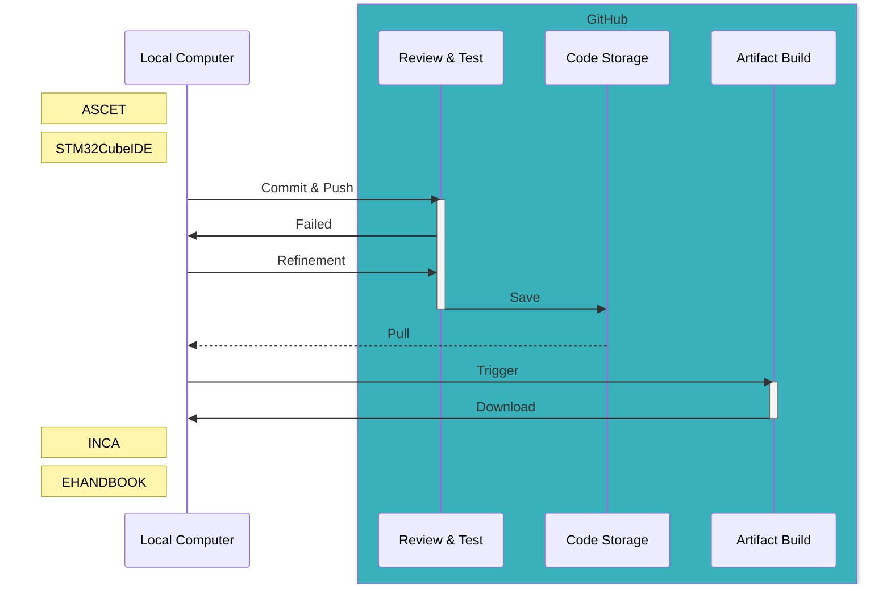

# ASCET GitHub Actions Demo

This an example repository to demonstrate the capabilities of ASCET-DEVELOPER in a
[Continuous Integration/Delivery](https://github.com/resources/articles/devops/ci-cd) (CI/CD) toolchain. It contains a small but
nifty "real-word" example project that defines the software driving a so called "Balance Tube" — a tube attached to a motor that
can be controlled by moving your hand closer or away from a distance sensor to keep the ball in the tube in balance. Everything
runs on an **ordinary** [NUCLEO-F334R8](https://www.st.com/en/evaluation-tools/nucleo-f334r8.html) evaluation board carrying a
STM32F334R8 microcontroller.

> [!NOTE]
> The focus of this repository is not on the Balance Tube as such, but on the automated test and build toolchain that is
> used to develop it. If you are interested in the Balance Tube itself, please refer to the dedicated
> [ASCET Examples and Discussions](https://github.com/etas/ascet) repository and especially the description of the
> [Balance Tube](https://github.com/etas/ascet/tree/main/BalanceTube).

The development workflow is depicted in the following schema and will be elaborated on in the following sections:

This repository contains the following components:

* `.github`: Contains the workflows that define the CI/CD process and build steps.
* `ASCET-DEVELOPER`: Contains the ASCET-DEVELOPER Balance Tube model and further support projects the main model depends on.
* `STM32CubeIDE`: Contains the STM32CubeIDE project for the Balance Tube including hand-written C code and a place for code that ASCET-DEVELOPER generates.

## Rational

To tackle the growing complexity of modern software development, a CI/CD toolchain is a must-have nowadays. It allows to automate
the build and test process, in order to ensure that the software is always in a working state and to deploy artifacts built from
it for further use in a controlled, deterministic, automated, documented and reproducible manner with artifacts that can be traced
back to exact revision which they were produced from.

We are convinced that this is likewise and especially important for embedded software, where the target platform is often not
easily accessible and the software is hard to debug. The fact that the software is based on a model developed in a tool like
ASCET-DEVELOPER and from which the effective runtime code is generated, is definitely not a blocker for CI/CD adoption. On the
contrary, it is a great opportunity to leverage the model-based development approach to facilitate and automate your software
development process. Processes known from modern software development like version control, code review, automated testing,
continuous integration, continuous deployment, etc. can be applied to model-based development as well.

## Workflows

GitHub is a code hosting platform for version control and collaboration. It lets you and others work together on project planning,
project management, code review, code management and automated artifact production. No change happens without a review and there
is always the guarantee that everything still works as specified. The test and build process is organized in so called
*workflows*, which are defined in the `.github/workflows` directory. They trigger each other, are started upon pull request
creation and can be started manually as well.

Workflows run on pre-configured virtual machines (VM) or physical computers — both referred to as *runners*. They have all the
tools installed that are needed to run the workflow. Runners are configured to run workflows in a clean state, so that workflows
can be run in a consistent environment without side effects from previous and on future runs.

> [!TIP]
> GitHub provides runners for Linux, Windows and macOS that come with a set of pre-installed standard software. If a workflow does
> not rely on any specific software, it can run on any runner without the need to maintain machines yourself.

Runners you setup and maintain yourself are called *self-hosted* runners.

A workflow defines one or more jobs of which each consists of one or more steps. Each step is a task that can run commands or
pre-defined actions (like checking out the repository or uploading created artifacts). Jobs can run in parallel given that
multiple runners are available to take up the work. They can also depend on each other, so that a job is only started if the
previous one was successful. Jobs can be triggered from other workflows, can be manually dispatched or can be automatically
started when certain events like a push to a branch or a pull request creation happen. For much more information about workflows
reach out to the [GitHub Actions documentation](https://docs.github.com/en/actions).

In this repository, we make use of the following workflows:

* `run-tests.yml`: This workflow run when a pull request is created or updated. It runs all tests and checks that checked-in ECU
  code is up-to-date. Without it running successfully, a pull request cannot be merged.
* `build-for-inca.yml`: This workflow can be dispatched manually from any branch or tag. It compiles the C code into a `.hex` and
  a `.a2l` file, puts both together with a few other `.a2l` files into an archive that can be be downloaded afterwards. This pair
  of files can be used to flash the ECU and to measure and calibrate the software with
  [INCA](https://www.etas.com/en/products/inca_software_products.php).
* `build-for-ehb.yml`: Like the previous workflow, it one can be dispatched manually from any branch or tag. It creates an
  EHANDBOOK container which can be downloaded afterwards. The container can be opened in
  [EHANDBOOK-NAVIGATOR](https://www.etas.com/en/products/ehandbook-navigator.php). After successfully connecting EHANDBOOK to
  INCA, measure values can be displayed directly in the graphical mode.
* `run-all.yml`: This workflow is a combination of all previous workflows. Consequently, it runs all checks and creates both the
  INCA archive and the EHANDBOOK container. It can be dispatched manually from any branch or tag.

## Preparation

### Runner Setup

This demo uses a self-hosted virtual machine (VM) that is equipped with the following software:

* [ASCET-DEVELOPER Community Edition](https://www.etas.com/en/products/ascet_developer.php)
* [EHANDBOOK Container Build](https://www.etas.com/en/products/ehandbook_container_build.php)
  * Requires a license that can be requested from ETAS.
  * Extensive documentation can be found [online](https://ehandbook.etas.com/docs/ehandbook/index.html).
* [STM32CubeIDE](https://www.st.com/en/development-tools/stm32cubeide.html)
  * Requires you to be logged in to an STMicroelectronics.
  * For your projects, drivers are only downloaded on demand. You can create a dummy project for your controller on the runner to
    initiate this download.
* [Git for Windows](https://git-scm.com/download/win)
  * During the installation process, choose to install the extended set of Unix tools on top.
  * Configure it for long file paths running `git config --system core.longpaths true` after the installation in a Command Shell.
* [PowerShell](https://github.com/PowerShell/PowerShell/releases)
* [Python 3](https://www.python.org/downloads/windows/)
* [Strawberry Perl](https://strawberryperl.com/)

> [!IMPORTANT]
> In the installation process, always accept the default install locations or otherwise adapt the paths in all workflows.

### Runner Connection

To make use of one or more self-hosted runners, you need to connect the previously configured machine(s) with your GitHub
repository. The GitHub UI guides you very well through the process. In any repository, go to `Settings` > `Actions` > `Runners` >
`New self-hosted runner` and follow the instructions to add a new self-hosted Windows runner.

> [!IMPORTANT]
> When you run the `./config.cmd` script, configure the client to run as a service and make sure that it executes with the same
> user that installed the software in the previous step. That might be the administrator of the machine depending on the
> requirements of the installed software. Setting it up as a service ensures that the runner is always available even after a
> reboot.
